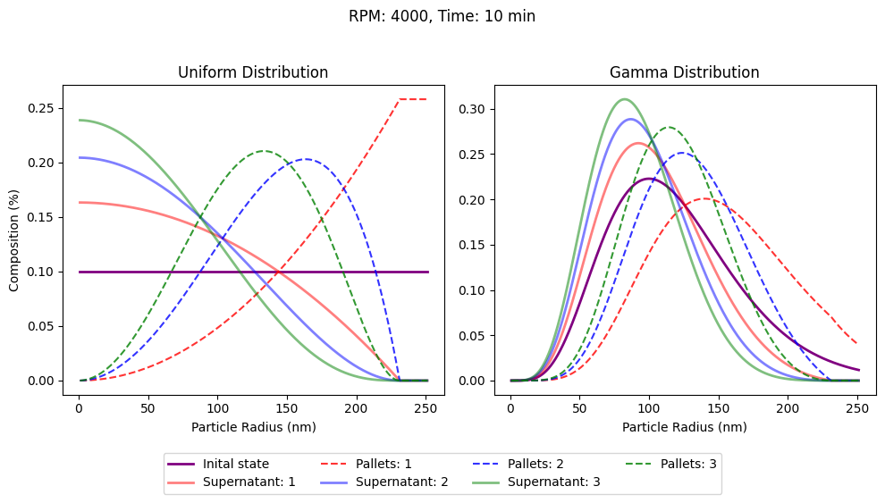

# pyspin
Simulating expected results from the centrifugation of nanoparticle colloids.  

## Background Theory

The theoretical foundation is straightforward, based on the sedimentation theory outlined by Mohr, H., & Völkl, A. (2017) in "Ultracentrifugation."

The sedimentation speed is defined as:

$$
\text{𝜈} = \frac{2r_s^2 (\rho_s - \rho_l)}{9\eta} F
$$

Where:

$$
F = \omega^2 r
$$

## Implementation

### Initial State

- **Uniform Distribution**: Each concentration of particles is assumed to be uniformly distributed in 1D space.
- **Parameter Setup**: Key parameters such as centrifuge speed, duration, arm length, particle and fluid density, and fluid viscosity are established.

### Sedimentation Rates

- **Determining Sedimentation Velocity**: Based on the parameters set, the sedimentation velocity is calculated for each particle size.

### Pellets or Supernatant

- **Classification**: Based on sedimentation velocities and the duration of centrifugation, a proportion of particles will reach the bottom of the container, forming pellets. Particles that do not reach the bottom will remain in the supernatant.

### Ratio of Ratios

- **New Concentration Distribution**: A new concentration distribution for each particle size is determined by reducing the initial concentration of particles by the ratio of particles that form pellets.
- **Centrifugation Cycles**: This reduction process, where the ratio is adjusted by another ratio over centrifugation cycles, is a key focus of the model.

---

Mohr, H., & Völkl, A. (2017). Ultracentrifugation. In eLS, John Wiley & Sons, Ltd (Ed.) (pp. 1-9).

---

# Example

